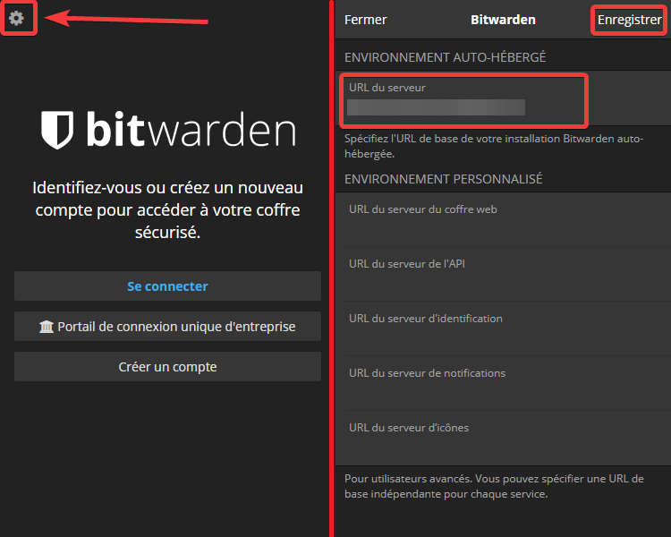

# Netboot - VaultWarden 

> VaultWarden implementation for my personal infrastructure.

The solution ? Vaultwarden, which is a clients-server based password manager. But to understand why it's really interesting, we also need to talk a bit about Bitwarden.

Bitwarden is a passwords manager that is based on a clients-server infrastructure, and there is a lot of clients (web, windows, macos, linux, browser integration, android, appstore and even some cli tools). There is a strong ecosystem around bitwarden which is the very cool part. Also it's opensource 🥳.

You can also host your own server, but it is resources expensive. But another server implementation was made, far more less demanding. This was originally called Bitwarden_RS and is now called Vaultwarden, and the official bitwarden clients are compatible with the vaultwarden server.

Let's finally go technical !

## Backup

This product is backup by [Duplicati](https://github.com/NetbootHome/Docker-Netboot-Backup) daily with following configuration:

* **Destination Type:** Microsoft OneDrive
* **Destination Folder**: `/Backups/Netboot/VaultWarden`
* **Schedule:** Every days at 3AM
* **Retention:** Smart backup retention

## Client Configuration

To use my instance, please customize the server uri following the address: <https://vault.netboot.fr>

## Please show the value

Choosing a project dependency could be difficult. We need to ensure stability and maintainability of our projects.
Surveys show that GitHub stars count play an important factor when assessing library quality.

⭐ Please give this repository a star. It takes seconds and help thousands of developers! ⭐

## Support development

It doesn't matter if you are a professional developer, creating a startup or work for an established company.
All of us care about our tools and dependencies, about stability and security, about time and money we can safe, about quality we can offer.
Please consider sponsoring to give me an extra motivational push to develop the next great feature.

> If you represent a company, want to help the entire community and show that you care, please consider sponsoring using one of the higher tiers.
Your company logo will be shown here for all developers, building a strong positive relation.

## How to Contribute

Everyone is welcome to contribute to this project! Feel free to contribute with pull requests, bug reports or enhancement suggestions.

## Bugs and Feedback

For bugs, questions and discussions please use the [GitHub Issues](https://github.com/NetbootCommunity/Netboot-VaultWarden/issues).

## License

This project is licensed under [MIT License](https://github.com/NetbootCommunity/Netboot-VaultWarden/blob/main/LICENSE).
